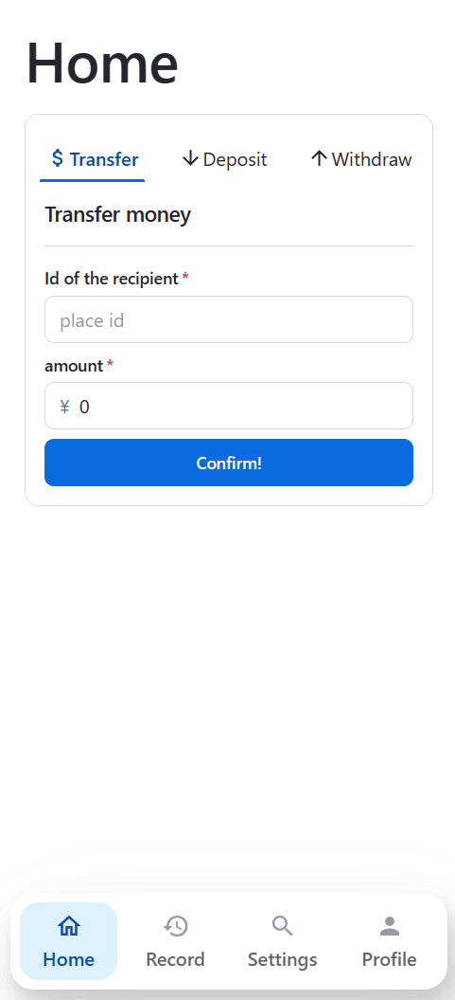
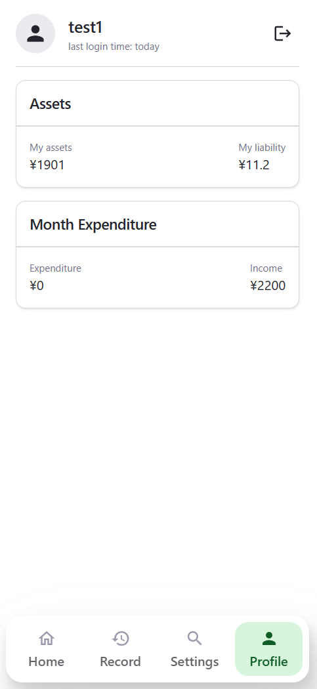
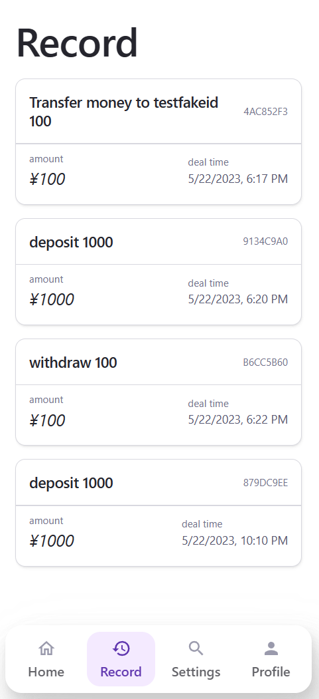

# Simple finance backend

一个简单的模拟金融后端, 基于 drogon 开发.

## 如何使用

环境要求：

- C++20
- vcpkg
- cmake
- nodejs

后端：

1. 安装依赖
   `vcpkg install drogon[core,ctl,sqlite3,orm]`
2. 开始构建
   ```bash
   cmake
   cmake --build ./build
   ```

前端：

1. 运行`npm i`
2. `npm start`

## 截图





